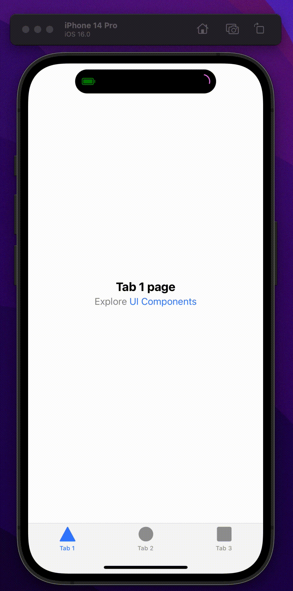

# Ionic Dynamic Island Component

- Dynamic Island App is built in ionic. App design is based on [Dynamic Island IPhone](https://dribbble.com/shots/19402908-The-Dynamic-Island-New-Era) designed by [Abhishek Ghorpade](https://dribbble.com/abhis_7).
This app is static. I mean, This is a UI design. No backend.

## Demo
    

- [Link Vercel Demo](https://ionic-dynamic-island.vercel.app/)

## Screenshots

